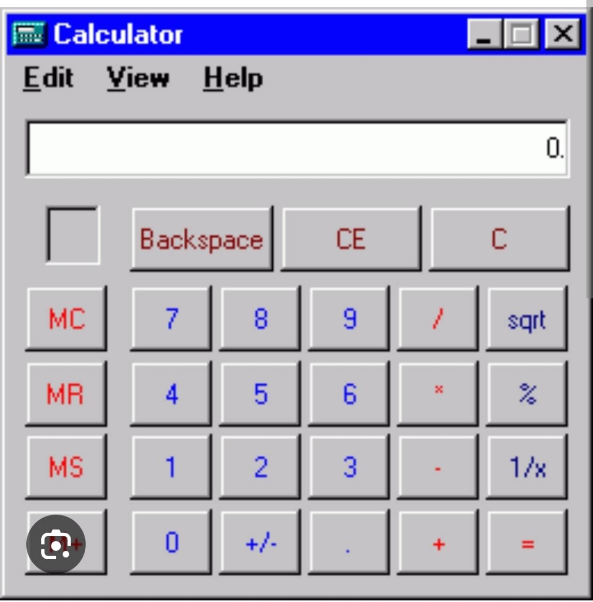

# Inside Me

Inside Me는 막연한 기분을 구체적인 감정과 욕구의 언어로 알아차리고 기록하도록 돕는 개인용 감정 탐색 일기 앱이다.

AI가 사용자의 마음을 판정하거나 진단하는 대신, 사용자가 자신의 경험을 표현하고 감정과 욕구를 직접 선택하도록 질문하고 기록을 돕는 것을 목표로 한다.

## 현재 상태

현재는 **IMP-003B1 구조화 어휘·가짜 탐색기 자동 검증 완료, 독립 검수 대기** 상태다. Node 24 LTS, Expo SDK 54와 Expo Router 기반의 최소 앱에 기록 계약과 전체 기록 parser를 두고, 대표 감정·욕구를 안정 ID와 주제로 검색하는 카탈로그 및 사용자 선택을 자동 확정하지 않는 가짜 탐색기를 추가했다. 테스트·타입·린트·Expo 로컬맵과 웹 번들은 통과했으며, 독립 검수 오류 0개 전에는 다음 IMP-003B2로 넘어가지 않는다. Android 실기기에서 Expo Go QR 실행은 아직 확인하지 않았다.

첫 구현에서는 Android 폰에서 다음 흐름을 끝까지 사용할 수 있게 만든다.

1. Expo Go로 앱을 연다.
2. 홈에서 `글로 기록하기`를 선택한다.
3. 오늘 있었던 일과 현재 기분을 적는다.
4. 사용자가 감정·욕구 목록을 직접 둘러보고 자신에게 가까운 표현을 먼저 고른다.
5. 원할 때만 앱의 보조 후보와 근거를 받아 비교한다.
6. 사용자가 감정, 강도와 욕구를 최종 확인하거나 수정한다.
7. 기록을 현재 기기에 저장한다.
8. 월간 달력에서 오늘의 표정을 확인한다.
9. 날짜를 눌러 저장한 기록을 다시 보고, 앱을 다시 열어도 남아 있는지 확인한다.

실제 AI를 연결하기 전에는 사용자가 구조화된 감정·욕구 어휘를 직접 둘러보고 선택하는 전체 흐름을 먼저 검증한다. 임시 탐색기와 실제 AI는 사용자가 도움을 요청했을 때 같은 데이터 형식으로 보조 후보를 제공한다. 이후 자유 음성 기록, AI 턴 대화, 음성 재생과 알림을 순서대로 연결한다.

## 핵심 원칙

- AI는 감정, 정신질환, 성격이나 타인의 의도를 사실처럼 단정하지 않는다.
- AI가 제안한 내용과 사용자가 최종 확인한 내용을 데이터에서 구분한다.
- AI 제안 전에 사용자가 감정·욕구 어휘를 직접 살펴보고 선택할 수 있게 한다.
- 감정 기록과 음성은 민감정보로 취급한다.
- 원본 음성은 전사와 분석이 성공하면 삭제하고 영구 저장하지 않는다.
- 첫 MVP 기록은 사용자 기기에 저장하며 기기 간 동기화는 이후로 미룬다.
- 자해·자살·타해 위험 대응 흐름이 확정되고 검증되기 전에는 외부 사용자에게 배포하지 않는다.
- 솔로 개발자가 매일 실제로 사용할 수 있는 가장 작은 완결 흐름을 우선한다.

## 기술 방향

- TypeScript
- React Native
- Expo
- Expo Router
- Android Expo Go를 이용한 첫 도그푸딩
- 핵심 Android 흐름 안정화 후 내부 APK와 PWA로 확장
- 기능 경계를 나누되 하나의 배포 단위로 시작하는 모듈형 모놀리스

프로젝트 구조는 별도 `frontend/`, `backend/` 프로젝트를 먼저 만들지 않고 하나의 Expo 프로젝트 안에서 `app/`, 기능, 핵심 규칙, 플랫폼 연동과 테스트 경계를 구분하는 방식으로 확정했다. 외부 AI 비밀 키가 필요할 때만 서버 경계를 추가한다.

## 문서 안내

- [제품 요구사항](docs/requirements.md): 현재 유효한 요구사항과 MVP 범위
- [제품 결정](docs/decisions.md): 선택지, 결정 상태, 트레이드오프와 재검토 조건
- [제품 대화 로그](docs/product-log.md): 사용자 발화와 당시 해석을 보존하는 추가 전용 기록
- [미결정 질문](docs/open-questions.md): 구현 전 또는 프로토타입 후 답할 질문
- [구현 계획](docs/implementation-plan.md): 사용자 행동으로 풀어 쓴 개발 순서와 완료 조건
- [지속 개발 워크플로](docs/development-workflow.md): 역할별 책임, 병렬 실행, 통합, 검증과 다음 작업 인계
- [클린 코드 지침](docs/clean-code-guidelines.md): 계층 방향, 런타임 데이터 검증, 이름·타입과 테스트 구조 기준
- [PR 작성 가이드](docs/pull-request-guide.md): 공통 PR 형식과 항목별 작성 원칙
- [AI 개발 지침](AGENTS.md): 저장소 전반의 작업, 안전과 개인정보 규칙

UI를 설계하거나 구현하기 전에는 [Hallmark 검토 노트](docs/references/hallmark.md)와 [Windows Classic UI 해석](docs/references/windows-classic-ui.md)을 함께 확인한다.

감정·욕구 자기 탐색 화면을 만들기 전에는 [사용자 제공 어휘 이미지 참고 노트](docs/references/emotion-needs-vocabulary-images.md)를 확인한다.

## 디자인 방향

[Hallmark](https://github.com/nutlope/hallmark)의 anti-AI-slop 원칙을 참고해 일반적인 AI 채팅·SaaS 화면처럼 보이는 획일적인 구성을 피한다. 다만 Hallmark를 정답으로 적용하지 않고 사용자가 제공한 참고자료, 감정 기록에 필요한 차분함, 접근성과 Inside Me의 제품 맥락을 우선한다.



> 초기 UI 디자인 레퍼런스이며 실제 Inside Me 앱의 데모 화면은 아니다. 각진 창, 파란 제목 표시줄, 입체 버튼과 안으로 들어간 입력 영역의 촉감을 참고하되 그대로 복제하지 않는다. 첫 Android 화면을 구현한 뒤 실제 앱 스크린샷으로 교체한다.

## 개발 시작

필요 환경은 Node.js 24.15.0 LTS와 npm 11.12.1이다. `nvm`을 사용하면 루트의 `.nvmrc`로 버전을 맞출 수 있다.

```bash
nvm use
npm ci
npm start
```

- Expo 패키지 호환성: `npm run check:expo`
- 단위·계약 테스트: `npm test`
- 타입 검사: `npm run typecheck`
- 린트: `npm run lint`
- 정적 웹 번들: `npm run export:web`

Jest 기반 단위·계약 테스트를 사용한다. 화면 테스트 확장과 로컬 저장 어댑터 선택은 `IMP-003`의 다음 조각에서 고정한다. Android Expo Go 실기기 검증은 사용자가 QR을 스캔해 성공을 확인해야 하며 웹 번들 성공으로 대체하지 않는다.

## 개인정보와 개발 데이터

실제 감정일기 원문, 음성, 전사, 인증정보와 API 키를 저장소, 테스트 데이터나 로그에 넣지 않는다. 예제와 테스트에는 합성 데이터만 사용한다.
