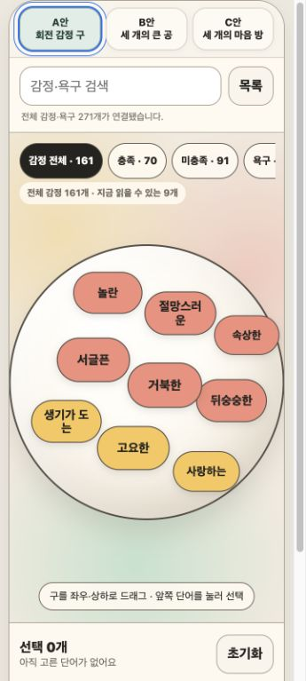
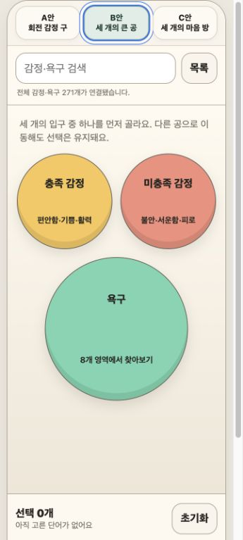
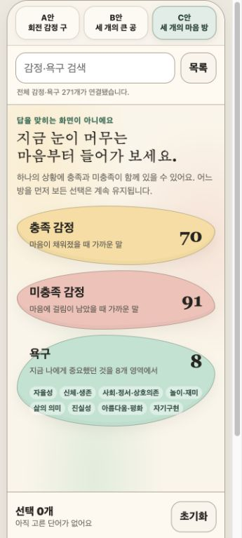

# 감정 지도 A·B·C 시안 비교와 C안 선택 기록

- 상태: C안 구현 기준 시안 확정
- 확정일: 2026-08-26
- 비교 조건: 동일한 목업, 브라우저 360×800 모바일 viewport 설정, 선택 0개인 첫 화면
- 저장 이미지: 브라우저 콘텐츠 영역 345×767 JPEG 세 장
- 관련 요구사항: REQ-004, REQ-026, REQ-027, REQ-028, REQ-029
- 관련 결정: DEC-061, DEC-062, DEC-063, DEC-064
- 관련 질문: Q-035

## 기록 목적

감정 탐색 UI가 바뀌더라도 어떤 후보를 비교했고 왜 C안을 골랐는지 확인할 수 있도록 최초 비교 화면과 판단 근거를 함께 보존한다. 아래 이미지는 실제 앱의 완성 화면이 아니라 `docs/prototypes/emotion-map-ab-preview.html`의 비교 시안이다.

세 안은 같은 정본 카탈로그에 연결된다. 충족 감정 70개, 미충족 감정 91개와 8개 영역의 욕구 110개로 총 271개이며, 첫 화면에 모든 단어를 동시에 표시한다는 뜻은 아니다.

## A안 — 회전 감정 구

- 장점: 공을 돌리며 단어를 발견한다는 탐색 행위가 가장 직접적이다.
- 한계: 휴대폰의 한 시점에 읽을 수 있는 단어가 적고, 161개 감정의 충족·미충족 구조와 욕구의 위치를 첫 화면에서 파악하기 어렵다.
- 판단: 탐색 아이디어는 남기되 현재 MVP의 구현 기준으로 선택하지 않는다.

## B안 — 세 개의 큰 공

- 장점: 충족 감정·미충족 감정·욕구의 세 축을 가장 빠르게 구분한다.
- 한계: 큰 공 하나를 먼저 선택해야 세부 단어를 볼 수 있어, 한 상황에서 충족과 미충족이 함께 있는 경우의 연결감이 약하다.
- 판단: 세 축의 즉시 이해라는 장점은 C안의 첫 화면에 반영한다.

## C안 — 세 개의 마음 방

- 장점: 세 축을 첫 화면에서 함께 보여 주고, 욕구 8개 영역을 미리 읽을 수 있다. 방을 바꾸어도 복수 선택을 유지하므로 충족·미충족 감정이 섞인 상황도 기록할 수 있다.
- 장점: 검색과 전체 목록을 대체 경로로 두면서도, 관련된 말 사이를 단계적으로 둘러보는 자기 탐색 흐름을 유지한다.
- 비용: 방 안에서 의미 묶음을 한 번 더 고르므로 모든 단어를 한 화면에서 훑는 조망은 줄어든다. 320px 가독성, 실제 손가락 탐색 피로와 TalkBack은 앱 반영 후 Android에서 확인해야 한다.
- 결정: 사용자가 감정일기의 현재 구현 기준 시안으로 C안을 선택했다.

## 선택의 의미와 변경 가능한 범위

C안 선택은 정보 구조와 탐색 흐름의 기준선을 정한 것이며, 픽셀 단위의 최종 디자인을 동결한 결정이 아니다.

- 유지할 기준: `충족 감정 / 미충족 감정 / 욕구`의 세 입구, 욕구 8개 영역 미리보기, 전체 271개 접근, 방 전환 후 혼합 선택 유지, 검색·전체 목록 대체 경로, AI 판단보다 사용자 자기 탐색 우선
- 계속 개선할 수 있는 범위: 파스텔 색상, 여백, 글꼴 크기, 유기형 도형, 그림자와 외곽선, 세부 문구, 단어 묶음의 배치와 전환 동작
- 프로덕션에서 제외할 요소: A·B·C 비교 탭과 시안 설명 문구
- 완료 경계: 이 문서와 캡처는 시안 확정 증거다. 실제 앱 구현 완료 또는 Android 실기기 검증 통과 증거가 아니다.

## 재검토 조건

실제 앱에서 원하는 단어를 찾기 어렵거나, 욕구 8개 미리보기가 작은 화면에서 읽히지 않거나, 의미 묶음이 정답 분류처럼 느껴지거나, 방 전환 단계가 기록을 방해하면 C안의 세 축은 유지하되 세부 배치·진입 단계·전체 펼치기 경로를 다시 설계한다.
